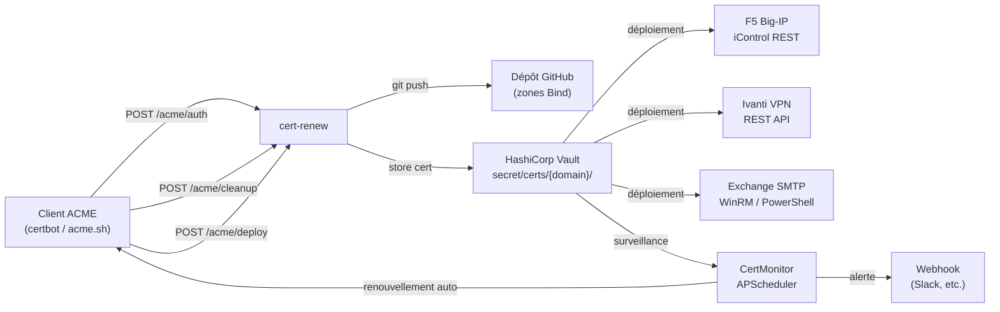

# cert-renew

Webhook FastAPI qui provisionne les défis ACME DNS-01 en ajoutant/supprimant
des enregistrements TXT dans des fichiers de zone Bind stockés dans un dépôt Git,
déploie optionnellement les certificats vers F5 Big-IP, Ivanti VPN, Exchange SMTP
(ou toute cible personnalisée via l'interface `DeployTarget`) et surveille
l'expiration.

## Fonctionnement

## Fonctionnalités clés

- **DNS-01 automatisé** — Le client ACME appelle le webhook en trois phases :
  `auth` (injection TXT), `cleanup` (suppression), `deploy` (stockage Vault).
- **Zones Bind dans Git** — Les fichiers de zone sont versionnés et poussés
  vers un dépôt Git. Idéal pour les pipelines GitOps.
- **Propagation DNS automatique** — Interrogation des serveurs DNS configurés
  jusqu'à ce que l'enregistrement TXT soit visible (optionnel).
- **Stockage Vault** — Les certificats émis sont stockés dans HashiCorp Vault
  via AppRole, avec le secret_id chargé depuis un fichier (jamais dans la config).
- **Cibles de déploiement multiples** — Déploiement vers F5 Big-IP, Ivanti VPN,
  Exchange SMTP, ou cible personnalisée via une interface Python.
- **Routage par domaine** — Chaque domaine peut être déployé vers un sous-ensemble
  de cibles, configurable dynamiquement via l'API.
- **Surveillance d'expiration** — Vérification périodique des certificats dans
  Vault, alertes via webhook Slack/HTTP, renouvellement automatique.
- **Wildcards** — Support complet des domaines wildcard (`*.example.com`) pour
  le DNS, Vault, F5, Ivanti et Exchange.
- **GlobalSign Atlas** — Support de l'External Account Binding (EAB) pour
  l'autorité de certification GlobalSign.

## Technologies

| Composant | Technologie |
|-----------|-------------|
| Framework | FastAPI (Python) |
| DNS | dnspython, fichiers de zone Bind |
| Git | GitPython, dépôt distant |
| Stockage | HashiCorp Vault (KV v2) |
| Déploiement | iControl REST, Ivanti REST API, WinRM/PowerShell |
| Conteneurisation | Docker, Docker Compose, Helm |
| CI | GitHub Actions |
